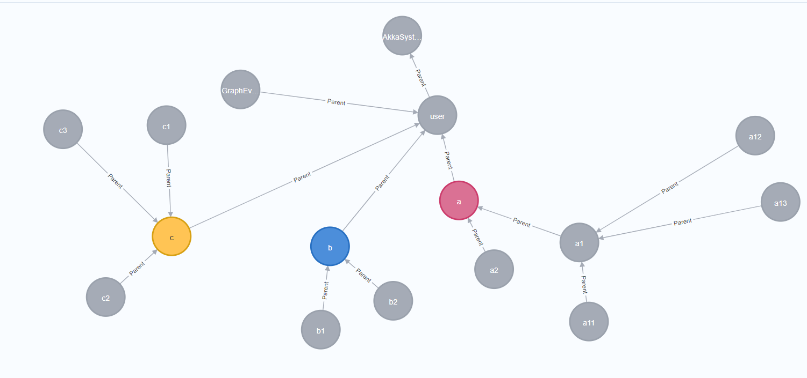

# AkkaNeo4j

Akka의 액터모델 계층구조를, Neo4j Graph DB를 활용하여 시각화하는 변종 프로젝트로~

- Asp.net Core에서 DI를 활용하여 액터를 구성하는 방법을 살펴볼수 있습니다.
- DockerCompose를 활용하여, Neo4j + AkkaNetApp 통합로컬 실행 가능합니다.
- 액터를 시각화함으로 Actor의 LifeCycle을 테스트 할수 있습니다.

## 로컬실행

- 전체구동 : docker-compose up -d (또는 VisualStudio DockerTool이용 )
- Neo4j : http://localhost:7474/browser/

## 액터계층구조

## Sample Code

### 

    //Neo4j 이벤트를 담당하는 액터생성
    _graphEventActorRef = _actorSystem.ActorOf(Props.Create<GraphEventActor>(_graphEngine),"GraphEventActor");

### 액터생성

    //
    var depth1_1 = _actorSystem.ActorOf(Props.Create<SimpleActor>("a", _graphEventActorRef),"a");
    var depth1_2 = _actorSystem.ActorOf(Props.Create<SimpleActor>("b", _graphEventActorRef),"b");
    var depth1_3 = _actorSystem.ActorOf(Props.Create<SimpleActor>("c", _graphEventActorRef),"c");

### 생성시 Graph 이벤트 발생

    //액터 생성시 
    public SimpleActor(string ActorName, IActorRef graphActorRef)
    {
        _graphActorRef = graphActorRef;
        _actorName = ActorName;

        _graphActorRef.Tell(new GraphEvent()
        {
            Action = "Create",
            Alice = ActorName,
            Name = ActorName
        });
    ...............,

### Neo4j CRUD를 처리하는 Actor

    public class GraphEventActor : ReceiveActor
    {
        private readonly ILoggingAdapter logger = Context.GetLogger();       
        private readonly GraphEngine graphEngine;
 
        public GraphEventActor(GraphEngine _graphEngine)
        {
            logger.Info($"Create GraphEventActor:{Context.Self.Path.Name}");
            graphEngine = _graphEngine;
 
            ReceiveAsync<GraphEvent>(async graphEvent =>
            {
                var cypher = await _graphEngine.GetCypher();
 
                switch (graphEvent.Action)
                {
                    case "Reset":
                        {
                            await _graphEngine.RemoveAll();
                        }
                        break;
                    case "Create":
                        {  
                            await cypher
                                .Create($"(element:GraphElementIdenty {{ UId: '{graphEvent.Uid}', Name:'{graphEvent.Name}'}})")
                                .ExecuteWithoutResultsAsync();

                            logger.Info($"Create : {graphEvent.Uid}");
                        }
                        break;
                    case "Delete":
                        {
                            //Delete a element and all inbound relationships
                            await cypher
                                .OptionalMatch("()<-[r]-(element:GraphElementIdenty)")
                                .Where((GraphElementIdenty element) => element.UId == graphEvent.Uid)
                                .Delete("r, element")                                
                                .ExecuteWithoutResultsAsync();

                            logger.Info($"Delete : {graphEvent.Uid}");
                        }
                        break;
                    case "Relation":
                        {
                            await cypher
                                .Match($"(a:GraphElementIdenty),(b:GraphElementIdenty)")
                                .Where($"a.UId = '{graphEvent.From.UId}' AND b.UId = '{graphEvent.To.UId}'")
                                .Create($"(a)-[r:{graphEvent.Name}]->(b)")
                                .ExecuteWithoutResultsAsync();

                            logger.Info($"Relation : {graphEvent.Name} {graphEvent.From.UId} -> {graphEvent.To.UId}");
                        }
                        break;
                }
            });
        }
    }

## 참고링크
- https://github.com/DotNet4Neo4j/Neo4jClient/wiki
- 